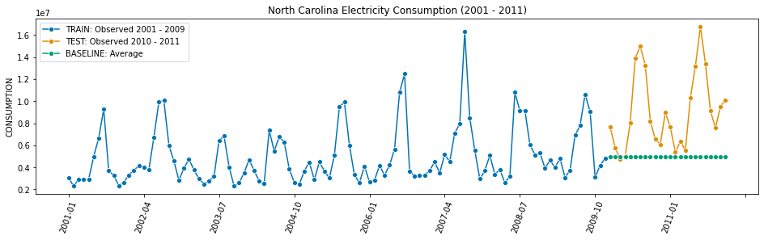
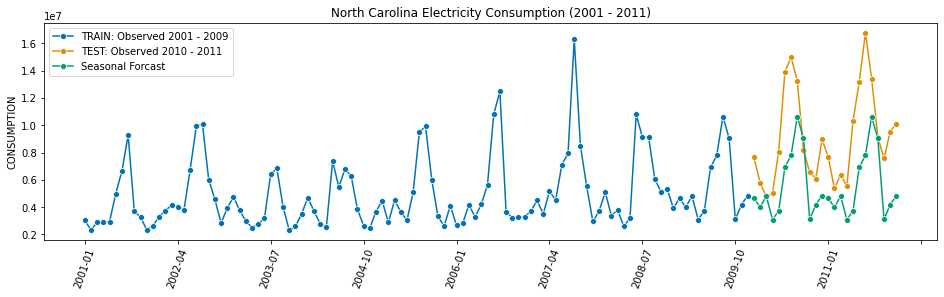
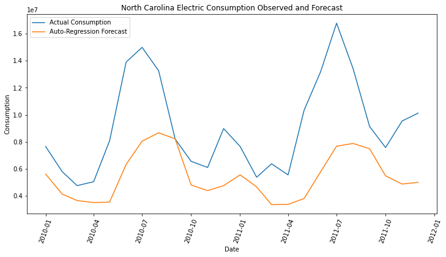
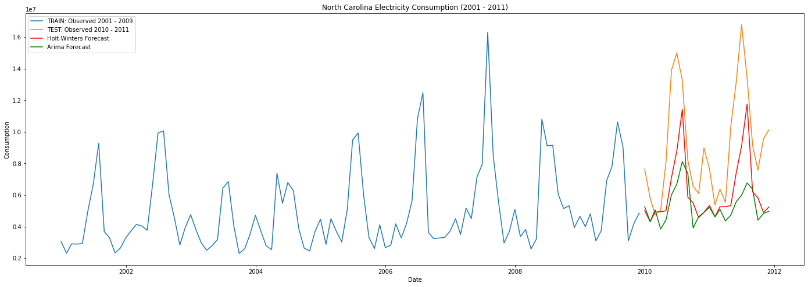
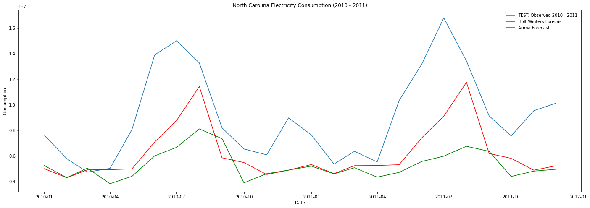

# Project 4
# *Hackathon*
From 9:30 AM to 3:30 PM, find a tabular dataset and make a predictive model with it.

[Hackathon rules](Hackathon_README.md)

## Contents
 - [Problem Statement](#Problem-Statement)
 - [Executive Summary](#Executive-Summary)
 - [File Directory](#File-Directory)
 - [Data](#Data)
 - [Data Dictionary](#Data-Dictionary)
 - [Conclusions and Recommendations](#Conclusions-and-Recommendations)
 - [Areas for Further Research/Study](#Areas-for-Further-Research/Study)
 - [Sources](#Sources)
 - [Visualizations](#Visualizations)

## Problem Statement
[back to top](#Project-4)

Using data from EIA (US Energy Information Administration) are there any patterns in electricity usage in North Carolina from 2001 through 2011, and can we use this data to make a predictive Time-Series Model?

## Executive Summary
[back to top](#Project-4)

Looking at Electrical usage can we forcast future Electrical usage in North Caroline. I selected North Carolina becasue I was looking for a State that would be a good representation of all of the States, and North Carolina seemd to be the most average  through my research.

## File Directory
[back to top](#Project-4)
### *Files should be clearly labeled with descriptive names*
03-Project 
| 
|__ code 
|&nbsp;&nbsp;&nbsp;&nbsp;|__ 00_table_of_contents.ipynb  
|&nbsp;&nbsp;&nbsp;&nbsp;|__ 01_eda_and_cleaning.ipynb  
|&nbsp;&nbsp;&nbsp;&nbsp;|__ 02_null_model.ipynb  
|&nbsp;&nbsp;&nbsp;&nbsp;|__ 03_time_series_models.ipynb  
|&nbsp;&nbsp;&nbsp;&nbsp;|__ 04_auto_regression.ipynb  
|&nbsp;&nbsp;&nbsp;&nbsp;|__ 05_analysis.ipynb  
|&nbsp;&nbsp;&nbsp;&nbsp;|__ 06_conclusion.ipynb  
| 
|__ data  
|&nbsp;&nbsp;&nbsp;&nbsp;|__ elec_mo_2001_2011_consumption.csv  
| 
|__ images  
|&nbsp;&nbsp;&nbsp;&nbsp;|__ electric_time_series_null_model.png  
|&nbsp;&nbsp;&nbsp;&nbsp;|__ electric_time_series_seasonal_forecast.png  
|&nbsp;&nbsp;&nbsp;&nbsp;|__ electricity_auto_regression_forecast.png  
|&nbsp;&nbsp;&nbsp;&nbsp;|__ electricity_test_forecast.png  
|&nbsp;&nbsp;&nbsp;&nbsp;|__ electricity_train_test_forecast.png  
| 
|__ presentation  
|&nbsp;&nbsp;&nbsp;&nbsp;|__ ChrisCaldarella_project4_presentation.pptx  
| 
|__ LICENSE  
|__ README.md  

## Data
[back to top](#Project-4)

I found some data about Electricity usage on [Data Is Plural — Structured Archive document](https://docs.google.com/spreadsheets/d/1wZhPLMCHKJvwOkP4juclhjFgqIY8fQFMemwKL2c64vk/edit#gid=0), which led me to the [US Energy Information Administration webpage](https://www.eia.gov/electricity/data/state/) where I found a monthly data set of energy consumption by month over several years.

## Data Dictionary
[back to top](#Project-4)

| Feature              | Python Type | Data Type  | Descritpion   |
| ---                  | ---         | ---        | :---           |
| date                 | DateTime    | Continuous | Date; First of the Month |
| STATE                | Object      | Nominal    | State being observed |
| CONSUMPTION          | float64     | Continuous | Amount of total energy consumed that month |

## Conclusions and Recommendations
[back to top](#Project-4)

It appears that the Holt-Winters performed the best out of all the models, and fits best when looking at plots.
​
​
SARIMAX did not do well, but the Seasonal model and the Auto-Regression Models seemed to do ok.
​
​
| Model\Score     | RMSE    | MAE     |
|---              |---      |---      |
| Holt-Winters    | 3631847 | 2920368 |
| Seasonal        | 4294624 | 3603229 |
| Auto-Regression | 4414239 | 3663597 |
| SARIMAX         | 4713245 | 3813522 |
| Null Model      | 5359973 | 4164017 |

## Areas for Further Research/Study
[back to top](#Project-4)

We can expand this to other states in the United States.

## Sources
[back to top](#Project-4)

https://www.eia.gov/electricity/data/state/  

## Visualizations
[back to top](#Project-4)

